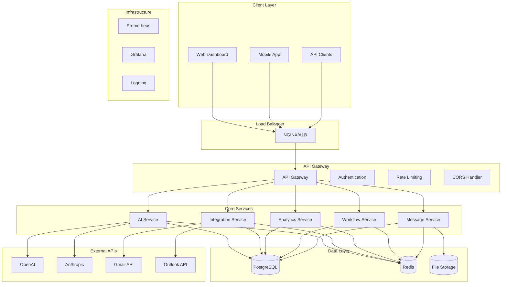
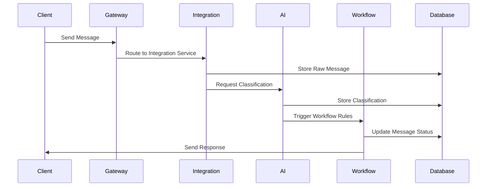

# Universal AI Customer Service Platform - Architecture Documentation

## 🏗️ System Architecture Overview

The Universal AI Customer Service Platform is built using a modern microservices architecture designed for scalability, reliability, and maintainability. This document provides a comprehensive overview of the system architecture, design decisions, and technical implementation.

## 📐 High-Level Architecture



## 🔧 Service Architecture

### API Gateway
**Purpose**: Central entry point for all client requests
**Technology**: Express.js with custom middleware
**Responsibilities**:
- Request routing and load balancing
- Authentication and authorization
- Rate limiting and throttling
- Request/response transformation
- API versioning
- CORS handling
- Request logging and monitoring

### AI Service
**Purpose**: AI-powered message processing and response generation
**Technology**: Node.js with TypeScript, OpenAI/Anthropic APIs
**Responsibilities**:
- Message classification and categorization
- Sentiment analysis and emotion detection
- Automated response generation
- Language detection and translation
- Custom model training and fine-tuning
- AI performance monitoring

### Integration Service
**Purpose**: Multi-channel communication integration
**Technology**: Node.js with OAuth 2.0, IMAP/SMTP
**Responsibilities**:
- Email provider integration (Gmail, Outlook)
- Real-time message synchronization
- Webhook management
- Protocol translation (IMAP/SMTP/API)
- Connection pooling and retry logic
- Integration health monitoring

### Analytics Service
**Purpose**: Data analysis and business intelligence
**Technology**: Node.js with time-series data processing
**Responsibilities**:
- Real-time metrics collection
- Performance analytics
- Business intelligence reporting
- Data aggregation and visualization
- Predictive analytics
- Custom dashboard generation

### Workflow Service
**Purpose**: Business process automation
**Technology**: Node.js with rule engine
**Responsibilities**:
- Workflow definition and execution
- Rule-based automation
- Event-driven processing
- Task scheduling and management
- Process monitoring
- Custom workflow templates

## 💾 Data Architecture

### Database Design
**Primary Database**: PostgreSQL 15
**Schema Design**: Multi-tenant with organization isolation

```sql
-- Core Tables
Organizations (id, name, settings, created_at, updated_at)
Users (id, organization_id, email, role, permissions)
Messages (id, organization_id, subject, content, status, metadata)
Integrations (id, organization_id, type, config, status)
Workflows (id, organization_id, name, rules, active)

-- AI Tables
Classifications (id, message_id, category, confidence, sentiment)
Responses (id, message_id, content, tone, generated_by)
Training_Data (id, organization_id, input, output, feedback)

-- Analytics Tables
Metrics (id, organization_id, metric_name, value, timestamp)
Events (id, organization_id, event_type, data, timestamp)
Reports (id, organization_id, type, config, schedule)
```

### Caching Strategy
**Cache Layer**: Redis 7
**Caching Patterns**:
- **Session Storage**: User sessions and authentication tokens
- **API Response Caching**: Frequently accessed data (TTL: 5-60 minutes)
- **Database Query Caching**: Complex query results (TTL: 1-24 hours)
- **AI Model Caching**: Classification models and responses (TTL: 1 hour)
- **Integration Data**: Email metadata and sync status (TTL: 15 minutes)

### File Storage
**Storage Solution**: AWS S3 / MinIO
**File Types**:
- Message attachments
- User profile images
- Export files and reports
- AI training datasets
- System backups

## 🔐 Security Architecture

### Authentication & Authorization
**Authentication**: JWT tokens with refresh mechanism
**Authorization**: Role-Based Access Control (RBAC)
**Session Management**: Redis-backed sessions with configurable TTL

```typescript
interface UserPermissions {
  messages: {
    read: boolean;
    write: boolean;
    delete: boolean;
    assign: boolean;
  };
  users: {
    read: boolean;
    write: boolean;
    delete: boolean;
    invite: boolean;
  };
  analytics: {
    read: boolean;
    export: boolean;
    configure: boolean;
  };
  integrations: {
    read: boolean;
    write: boolean;
    configure: boolean;
  };
}
```

### Data Protection
**Encryption at Rest**: AES-256 encryption for sensitive data
**Encryption in Transit**: TLS 1.3 for all communications
**Key Management**: AWS KMS / HashiCorp Vault
**Data Masking**: PII masking in logs and non-production environments

### Security Middleware
- **Rate Limiting**: IP and user-based rate limiting
- **Input Validation**: Comprehensive input sanitization
- **CORS Protection**: Configurable cross-origin policies
- **Security Headers**: OWASP recommended headers
- **SQL Injection Prevention**: Parameterized queries only
- **XSS Protection**: Content Security Policy implementation

## 📊 Monitoring & Observability

### Metrics Collection
**Metrics System**: Prometheus with custom exporters
**Key Metrics**:
- **Application Metrics**: Response times, error rates, throughput
- **Business Metrics**: Message volume, AI accuracy, user activity
- **Infrastructure Metrics**: CPU, memory, disk, network usage
- **Custom Metrics**: Organization-specific KPIs

### Logging Strategy
**Log Aggregation**: Structured JSON logging
**Log Levels**: ERROR, WARN, INFO, DEBUG
**Log Retention**: 30 days for application logs, 90 days for security logs

```typescript
interface LogEntry {
  timestamp: string;
  level: 'ERROR' | 'WARN' | 'INFO' | 'DEBUG';
  service: string;
  requestId: string;
  userId?: string;
  organizationId?: string;
  message: string;
  metadata?: Record<string, any>;
}
```

### Health Checks
**Endpoint Types**:
- **Liveness Probe**: `/health/live` - Service is running
- **Readiness Probe**: `/health/ready` - Service can handle requests
- **Detailed Health**: `/health/detailed` - Comprehensive status

## 🚀 Deployment Architecture

### Container Strategy
**Containerization**: Docker with multi-stage builds
**Base Images**: Node.js Alpine for minimal attack surface
**Image Optimization**: Layer caching and dependency optimization

### Orchestration
**Kubernetes Deployment**:
- **Namespaces**: Environment isolation
- **Deployments**: Rolling updates with zero downtime
- **Services**: Internal service discovery
- **Ingress**: External traffic routing
- **ConfigMaps/Secrets**: Configuration management

**Docker Compose Alternative**:
- Development and small-scale deployments
- Simplified service orchestration
- Local development environment

### Scaling Strategy
**Horizontal Scaling**:
- **Auto-scaling**: CPU and memory-based scaling
- **Load Balancing**: Round-robin with health checks
- **Service Mesh**: Istio for advanced traffic management

**Vertical Scaling**:
- **Resource Limits**: Configurable CPU and memory limits
- **Performance Monitoring**: Resource usage optimization

## 🔄 Data Flow Architecture

### Message Processing Flow


### AI Processing Pipeline
1. **Input Validation**: Message content and metadata validation
2. **Preprocessing**: Text cleaning and normalization
3. **Classification**: Category and sentiment analysis
4. **Context Building**: Historical data and customer information
5. **Response Generation**: AI-powered response creation
6. **Post-processing**: Quality checks and formatting
7. **Feedback Loop**: Performance tracking and model improvement

## 🔧 Technology Stack

### Backend Technologies
- **Runtime**: Node.js 18+ with TypeScript
- **Framework**: Express.js with custom middleware
- **Database**: PostgreSQL 15 with Prisma ORM
- **Cache**: Redis 7 for session and data caching
- **Queue**: Bull/BullMQ for background job processing
- **Testing**: Jest with comprehensive test coverage

### AI & Machine Learning
- **Providers**: OpenAI GPT-4, Anthropic Claude, Google AI
- **Libraries**: LangChain for AI orchestration
- **Models**: Custom fine-tuned models for classification
- **Training**: Continuous learning from user feedback

### Infrastructure
- **Containerization**: Docker with multi-stage builds
- **Orchestration**: Kubernetes with Helm charts
- **Monitoring**: Prometheus and Grafana
- **Logging**: Structured logging with ELK stack
- **CI/CD**: GitHub Actions with automated testing

### Frontend Technologies
- **Framework**: React 18 with TypeScript
- **State Management**: Redux Toolkit with RTK Query
- **UI Library**: Material-UI with custom theming
- **Build Tool**: Vite for fast development builds
- **Testing**: React Testing Library and Cypress

## 📈 Performance Considerations

### Optimization Strategies
**Database Optimization**:
- Connection pooling (10-20 connections per service)
- Read replicas for analytics queries
- Proper indexing strategy
- Query optimization and monitoring

**Caching Strategy**:
- Multi-layer caching (application, database, CDN)
- Cache invalidation strategies
- Cache warming for critical data
- Cache hit rate monitoring (target: >90%)

**API Optimization**:
- Response compression (gzip)
- Pagination for large datasets
- Field selection for GraphQL-style queries
- HTTP/2 support for multiplexing

### Performance Targets
- **Response Time**: <200ms for 95% of requests
- **Throughput**: 1000+ concurrent users
- **Uptime**: 99.9% availability
- **AI Processing**: <5 seconds for complex queries
- **Database Queries**: <50ms average response time

## 🔮 Future Architecture Considerations

### Scalability Enhancements
- **Microservices Decomposition**: Further service breakdown
- **Event-Driven Architecture**: Async communication patterns
- **CQRS Implementation**: Command Query Responsibility Segregation
- **Multi-Region Deployment**: Global distribution strategy

### Technology Evolution
- **Serverless Migration**: AWS Lambda/Azure Functions
- **Edge Computing**: CDN-based processing
- **GraphQL Federation**: Unified API layer
- **Service Mesh**: Advanced traffic management

This architecture provides a solid foundation for a scalable, secure, and maintainable AI-powered customer service platform that can grow with business needs while maintaining high performance and reliability standards.
